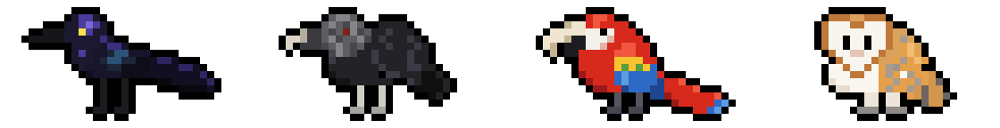
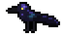
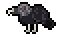
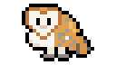
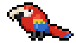
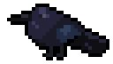

# Pájaros de Cartagena



Cuatro pájaros de Cartagena de Indias, dibujados píxel a píxel, que saltan y vuelan por tus notas de Obsidian y por las páginas web que visitas. Y un invitado secreto: el cuervo de Edgar Allan Poe.

## Los pájaros

| | Pájaro | Especie | Cómo se consigue |
|---|---|---|---|
|  | Mariamulata | *Quiscalus mexicanus* | Te acompaña desde el principio |
|  | Golero | *Coragyps atratus* | Pluma común |
|  | Lechuza | *Tyto alba* | Pluma común |
|  | Guacamaya | *Ara macao* | Pluma poco común |
|  | Cuervo | *Corvus corax* | Secreto: la pista está en la guía de campo |

## Qué hace

- Tu pájaro salta por la pantalla y vuela de un elemento a otro de la página.
- Puedes acariciarlo, ponerle nombre y vestirlo con once sombreros, gorros y cascos.
- De vez en cuando cae una pluma: si la atrapas, desbloqueas un pájaro nuevo en la guía de campo.
- Puedes dejar notas adhesivas que siguen ahí aunque recargues la página.
- No recopila datos: todo se guarda en tu equipo.

## Instalación

### Obsidian

Todavía no está en el directorio de complementos de Obsidian, así que se instala a mano:

1. Dentro de tu bóveda, crea la carpeta `.obsidian/plugins/pajaros-de-cartagena`.
2. Copia en ella los archivos `main.js` y `manifest.json` de la [última versión publicada](https://github.com/CasaAmarillaRoja/pajaros-de-cartagena/releases/latest). También están en [`dist/obsidian`](dist/obsidian).
3. Reinicia Obsidian, ve a los ajustes de complementos de la comunidad y activa «Pájaros de Cartagena».

Si tienes instalado el Pocket Bird original, desactívalo para no tener dos pájaros a la vez.

### Chrome y Edge

1. Descarga `extension.zip` de la [última versión publicada](https://github.com/CasaAmarillaRoja/pajaros-de-cartagena/releases/latest) y descomprímelo.
2. Abre `chrome://extensions` (en Edge, `edge://extensions`) y activa el modo de desarrollador.
3. Carga la extensión sin empaquetar y elige la carpeta que acabas de descomprimir.

### Firefox

1. Abre `about:debugging#/runtime/this-firefox`.
2. Carga un complemento temporal y elige el archivo `manifest.json` de la carpeta de `extension.zip` descomprimida.

Firefox lo retira al cerrarse. Para dejarlo instalado de forma permanente hay que firmarlo antes en addons.mozilla.org.

### Tampermonkey

Con [Tampermonkey](https://www.tampermonkey.net/) instalado, abre este enlace y confirma la instalación: [birb.user.js](https://github.com/CasaAmarillaRoja/pajaros-de-cartagena/raw/refs/heads/main/dist/userscript/birb.user.js).

### En tu propia web

Añade esta línea en cualquier parte de tu HTML:

```html
<script src="https://cdn.jsdelivr.net/gh/CasaAmarillaRoja/pajaros-de-cartagena@main/dist/web/birb.embed.js"></script>
```

## Preguntas frecuentes

### ¿Cómo acaricio a mi pájaro?

Pasa el cursor por encima de él, de un lado a otro, hasta que aparezca un corazón. También puedes hacer clic en él y elegir «Acariciar al pájaro».

### ¿Cómo consigo plumas?

Mientras la ventana está activa, de vez en cuando cae una pluma desde la parte de arriba. Haz clic en ella para añadir su pájaro a la guía de campo. Después de acariciar a tu pájaro, durante cinco minutos es el doble de probable que caiga una.

### ¿Cómo cambio de pájaro?

Haz clic en tu pájaro, abre la guía de campo y elige uno de los que ya hayas desbloqueado.

### ¿Cómo lo escondo?

Haz clic en él y elige «Ocultar al pájaro». Vuelve a aparecer cuando recargas la página.

## Compilar

```bash
npm install
npm run build
```

La compilación deja en `dist/` las versiones para Obsidian, el navegador, Tampermonkey y la web.

Cada pájaro tiene su propia hoja de *sprites* en `sprites/birds/`: diez fotogramas de 32 × 32 píxeles, en este orden: base, cabeza baja, tres corazones, dos huecos para el copete (sin uso), alas arriba, alas abajo y ojos felices. Las alas y los ojos felices son capas que se superponen al fotograma base o al de cabeza baja. Los colores de la pluma de cada pájaro están en `sprites/species.png`.

## Créditos

Pájaros de Cartagena es una bifurcación de [Pocket Bird](https://github.com/IdreesInc/Pocket-Bird), creado por [Idrees Hassan](https://idreesinc.com). Suyos son el código original, los sombreros, los corazones, la pluma y la fuente [Monocraft](https://github.com/IdreesInc/Monocraft). En esta versión los pájaros son nuevos, la interfaz está en español y cada especie tiene su propia hoja de *sprites*.

Se distribuye con la misma licencia que el original: [Mozilla Public License 2.0](LICENSE).

Las descripciones de la guía de campo se basan en artículos de Wikipedia en español ([*Quiscalus mexicanus*](https://es.wikipedia.org/wiki/Quiscalus_mexicanus), [*Coragyps atratus*](https://es.wikipedia.org/wiki/Coragyps_atratus), [*Ara macao*](https://es.wikipedia.org/wiki/Ara_macao), [*Tyto alba*](https://es.wikipedia.org/wiki/Tyto_alba), [*Corvus corax*](https://es.wikipedia.org/wiki/Corvus_corax) y [«El cuervo (poema)»](https://es.wikipedia.org/wiki/El_cuervo_(poema))), publicados con licencia [CC BY-SA 4.0](https://creativecommons.org/licenses/by-sa/4.0/deed.es). El origen taíno de la palabra está tomado de la entrada [*guacamayo*](https://dle.rae.es/guacamayo) del *Diccionario de la lengua española*, que recoge *guacamaya* como sinónimo.
